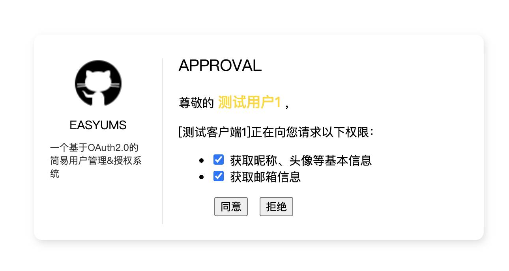
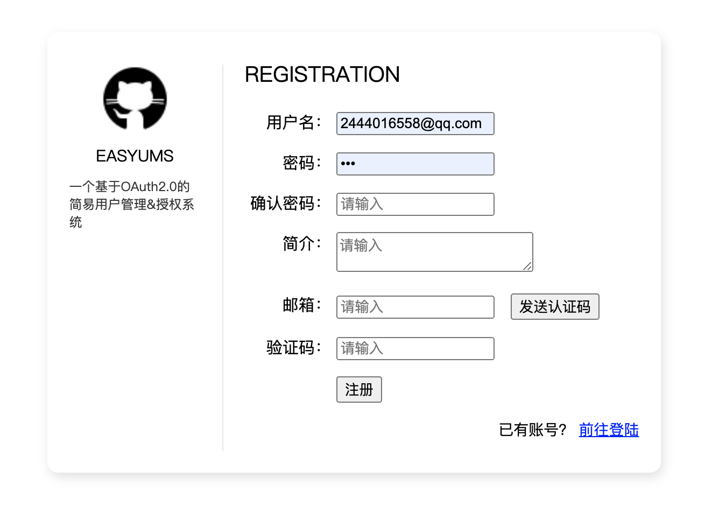
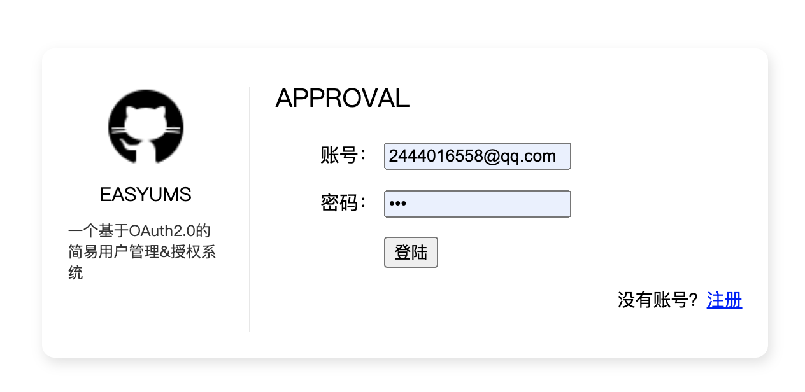
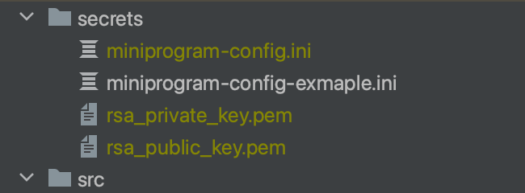

# EASYUMS

easyums为一个基于OAuth2.0的简易用户管理&授权系统，旨在为用户提供一种安全、高效的方式来管理自己的账号资源，表现在以下几个方面。

+ 自主授权

  当第三方系统应用向用户申请获取资源时，用户可选择同意或拒绝申请，而无需向其提供账号信息（如账号、密码）。

+ 统一信息管理

  easyums可向第三方应用提供基本&公开的用户数据，可减少用户在注册账号时需要填写的表单信息。

+ 统一认证服务
  
    用户可通过easyums登录到第三方应用，有效解决了忘记账号密码的难题。

easyums是现今多应用、多账号体系下的一个解决方案。



*图1 系统截图1*



*图2 系统截图2*



*图3 系统截图3*

***

## 一、功能

本项目目前只实现了四种授权模式中的*授权码模式（authorization code）*。

- [x] authorization code
- [ ] implicit
- [ ] password
- [ ] client credentials

## 二、启动系统

1、修改配置文件

将oauth目录下的"app.example.ini"修改为"app.ini"，并填写需要的数据库、邮箱等配置信息，部分内容如下：

```ini
# 数据库配置信息
[database]
host=localhost
port=3306
user=root
password=
db_name=easyums

[redis]
host=localhost
port=6379
```

2、生成秘钥

基于安全问题，系统的数字签名部分逻辑使用了非对称加密方式，以防止数据篡改。

具体是IDToken使用了非对称加密，授权服务器（即本系统）使用私钥进行签名，客户端使用公钥进行解密。

在终端执行该脚本文件：

```bash
cd oauth

node src/script/generateKeyPair.js
```

默认的情况下，执行该脚本后，会在"oauth/secrets"目录下生成两个文件：



其中"rsa_private_key.pem"为私钥，私钥保存在授权服务器（或其他别的位置）；"rsa_public_key"为公钥，公钥将发放给接入easyums的客户端。

在配置文件中补充私钥的存放路径：

```ini
[jwt]
# ...
# 私钥路径
rsa_primary_key=/your/path/rsa_private_key.pem
```

（注意，每次执行该脚本时，都会重新生成钥匙串，此前已经在使用的客户端也必须要换上新的公钥，所以请谨慎执行）

3、创建数据库

在数据库中执行以下sql文件，生成数据表。

> oauth/easyums.sql

4、创建客户端

系统运行前，需要保证数据库中已经存在对应的客户端信息，即给第三方应用系统对接的客户端，否则系统无法正常运行。

事实上，在执行sql文件的时候，已经在客户端表中插入了客户端信息，此时将该客户端的必要信息拷贝给第三方应用即可，当然，也可以自己另外新建客户端。

（目前没有做管理后台，只能直接在数据库层面操作）

5、执行启动脚本

到这里，前期的准备工作已全部完成，在终端执行以下命令启动系统。

```bash
cd oauth
# 赋予执行权限
chmod u+x bin/www

npm run start
```

在终端看到如下输出信息后，表示系统启动成功。

```text
App running at：
- http://localhost:8084
- http://192.168.3.18:8084
```

## 三、对接示例

以下仅提供了基于js的代码，对于js以外的语言，其实也是大同小异，如有需要还请自行实现。

> https://github.com/xxzhiwei/demo/tree/master/easyums-demo

## 四、接口列表

### 1、客户端向

*以下是面向客户端的接口。*

#### 1.1、授权（获取授权码）

> /oauth2/authorize

从客户端（web）跳转至授权服务器，并进入授权界面，经用户授权后，重定向到指定的地址，授权码（code）将以url参数的形式返回给客户端。

请求方法：GET

请求参数：

（若无其他额外说明，GET请求方法的参数默认拼接在请求路径之后）

| 参数 | 参数值 | 描述 | 必填 | 说明 |
| ---- | ---- | ---- | ---- | ---- | 
| response_type | code | 响应类型 | 是 | 固定值 |
| redirect_uri | | 重定向地址 | 是 | 必须包含在客户端的重定向地址中 |
| client_id | | 客户端id | 是 |  |
| scope | openid,profile,email,address | 权限范围 | 是 | 以空格分开 |
| state |  | 状态 | 否 | 随机值；如果传输时，服务器会原路返回 |

响应数据：

```text
301 http://localhost:8087/callback?code=abc
```

#### 1.2、获取令牌

> /oauth2/token

请求方法：POST

请求头：

| 参数 | 参数值 | 描述 | 必填 | 说明 |
| ---- | ---- | ---- | ---- | ---- |
| Authorization | Basic base64(client_id:client_secret) | 认证信息 | 是 | id和secret中间使用":"分隔，进行base64编码后传输 |
| Content-type | application/json | 内容类型 | 是 |  |

请求参数：

| 参数 | 参数值 | 描述 | 必填 | 说明 |
| ---- | ---- | ---- | ---- | ---- | 
| grant_type | authorization_type | 授权方式 | 是 |  |
| redirect_uri | | 重定向地址 | 是 | 必须包含在客户端的重定向地址中 |
| client_id | | 客户端id | 是 |  |
| code | | 授权码 | 是 |  |

响应数据：

```json
{
    "error": "",
    "payload": {
        "access_token": "",
        "refresh_token": "",
        "token_type": "bearer",
        "id_token": ""
    }
}
```

## 五、错误码对照列表

> ./error.md

[error.md](error.md)

***

参考资料（感谢）：

* [什么是 ID Token](https://docs.authing.cn/v2/concepts/id-token.html)
* [What ID Token Is](https://cloudentity.com/developers/basics/tokens/id-token/)
* [后端如何选择使用 id_token 还是 access_token?](https://www.zhihu.com/question/540025439)
* [Access Token vs Id Token](https://docs.authing.cn/v2/concepts/access-token-vs-id-token.html)
* [OpenID 和 OAuth 有什么区别？](https://www.zhihu.com/question/19628327)
* [马里奥的 OAuth 2.0 历险记](https://www.zhihu.com/column/c_1628366409720881152)
* [Microsoft identity platform UserInfo endpoint](https://learn.microsoft.com/en-us/entra/identity-platform/userinfo)
* [oauth-in-action-code](https://github.com/oauthinaction/oauth-in-action-code/)
